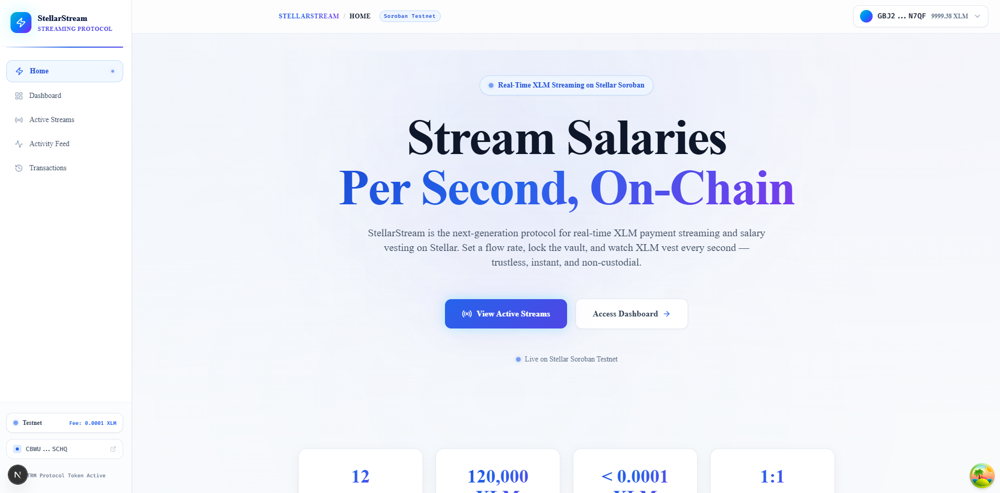
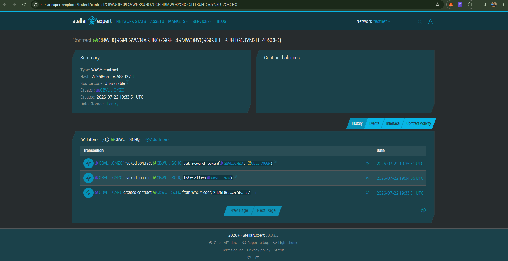

# ⚡ StellarStream — Real-Time XLM Payment & Salary Vesting Protocol

<div align="center">


**Stream XLM salaries per second. Vest funds on-chain. Earn STRM tokens. No intermediaries.**

[🌐 Live Vercel App](https://stellar-stream.vercel.app) · [📹 Live Demo Video](https://youtu.be/your-demo-video) · [Stellar Expert Explorer](https://stellar.expert/explorer/testnet/contract/CBWUQRGPLGVWNXSUNO7GGET4RMWQBYQRGGJFLLBUHTG6JYN3LUZOSCHQ) · [GitHub Repo](https://github.com/sdutta2004/StellarStream)

</div>

---

## 🔗 Live Links & Demo

- 🌐 **Live Vercel Application**: [https://stellar-stream.vercel.app](https://stellar-stream.vercel.app)
- 📹 **Live Video Demo**: [Watch Walkthrough Video](https://youtu.be/your-demo-video) *(Replace with your video link)*
- 📜 **StellarStream Smart Contract**: [`CBWUQRGPLGVWNXSUNO7GGET4RMWQBYQRGGJFLLBUHTG6JYN3LUZOSCHQ`](https://stellar.expert/explorer/testnet/contract/CBWUQRGPLGVWNXSUNO7GGET4RMWQBYQRGGJFLLBUHTG6JYN3LUZOSCHQ)
- 🪙 **STRM Token Contract**: [`CBLCBZNJBLS3SSMVZUAPIK53QOCPOYXMJPMS3L7TZSFH7SGKRWEGM66M`](https://stellar.expert/explorer/testnet/contract/CBLCBZNJBLS3SSMVZUAPIK53QOCPOYXMJPMS3L7TZSFH7SGKRWEGM66M)

---

## 📸 Screenshots & Preview

<div align="center">

### 📊 StellarStream Dashboard & Stream Interface


### 🔍 Stellar Expert Contract Explorer


</div>

---

## 🌊 What is StellarStream?

StellarStream is a decentralized real-time XLM payment streaming and salary vesting protocol built on **Stellar Soroban smart contracts**. Instead of lump-sum payments, funds vest continuously per second — giving recipients transparent, trustless, and cancelable access to earnings.

**Key Innovations:**
- 🔴 **Per-Second Vesting** — XLM vests every second on-chain via Soroban
- ⚡ **Instant Cancellation** — Senders cancel anytime; unvested funds auto-return
- 🪙 **STRM Protocol Tokens** — 1 STRM minted per 1 XLM streamed (1:1 cross-contract mint)
- 🔒 **Non-Custodial Vaults** — Smart contract holds funds; no platform custody

---

## 🏗️ Architecture Flow

```
Stream Sender (Employer)
        │
        ▼
  [create_campaign]  ──► StellarStreamContract (WASM)
        │                       │
        │                 stream vault locked
        │                 XLM held in escrow
        │
        ▼
  [donate / deposit]  ──► XLM transferred to vault
        │                       │
        │                 ┌─────▼──────────────────┐
        │                 │  CrossContract Call     │
        │                 │  StreamTokenContract    │
        │                 │  mint(recipient, amt)   │
        │                 │  1 STRM : 1 XLM        │
        │                 └─────────────────────────┘
        │
        ▼
  [withdraw]  ──► Vested XLM released to sender/recipient
        │
        ▼
  [refund]   ──► Unvested XLM returned on stream cancel/expiry
```

---

## 📦 Smart Contract Addresses (Testnet)

| Contract | Address |
|---|---|
| **StellarStream Contract ID** | `CBWUQRGPLGVWNXSUNO7GGET4RMWQBYQRGGJFLLBUHTG6JYN3LUZOSCHQ` |
| **STRM Token Contract ID** | `CBLCBZNJBLS3SSMVZUAPIK53QOCPOYXMJPMS3L7TZSFH7SGKRWEGM66M` |
| **Deployer Wallet Address** | `GBVLCPD3N67ZMJ7KEMN577ZJLNZLPD77VWYLTYO56QPXUPH7V4B4CMZO` |
| **Freighter Wallet (Default)** | `GBJ2JX6FPAW3E6ZCSGKDRXDGCMJJWRSYQCJLZ7APX2ICKIYWAMDON7QF` |
| **Native XLM Asset** | `CDLZFC3SYJYDZT7K67VZ75HPJVIEUVNIXF47ZG2FB2RMQQVU2HHGCYSC` |
| **Network** | Stellar Testnet |

[View Contract on Stellar Expert](https://stellar.expert/explorer/testnet/contract/CBWUQRGPLGVWNXSUNO7GGET4RMWQBYQRGGJFLLBUHTG6JYN3LUZOSCHQ)

---

## 🔧 Contract Entrypoints

### `StellarStreamContract` (`stellar_stream.wasm`)

| Function | Parameters | Description |
|---|---|---|
| `initialize` | `admin: Address` | One-time contract setup |
| `set_reward_token` | `admin, token_address` | Link STRM token contract |
| `get_reward_token` | — | Get STRM token address |
| `create_campaign` | `creator, title, description, goal, deadline` | Create payment stream vault |
| `donate` | `campaign_id, donor, amount` | Deposit XLM into stream vault |
| `withdraw` | `campaign_id, creator` | Withdraw vested XLM |
| `refund` | `campaign_id, donor` | Cancel stream & refund unvested XLM |
| `get_campaign` | `campaign_id` | Query single stream |
| `get_campaigns` | `start_id, limit` | Paginated stream list |
| `get_donations` | `campaign_id` | Get vault deposits for stream |
| `get_admin` | — | Get admin address |
| `extend_deadline` | `campaign_id, creator, new_deadline` | Extend stream end time |

### `StreamTokenContract` (`stream_token.wasm`)

| Function | Parameters | Description |
|---|---|---|
| `initialize` | `admin, name, symbol` | Init STRM token (`"StellarStream Reward"`, `"STRM"`) |
| `mint` | `to, amount` | Mint STRM (admin/StellarStream contract only) |
| `transfer` | `from, to, amount` | Transfer STRM tokens |
| `balance_of` | `owner` | Get STRM balance |
| `name` | — | Returns `"StellarStream Reward"` |
| `symbol` | — | Returns `"STRM"` |
| `admin` | — | Get admin address |

---

## 🚀 Quick Start

### Prerequisites

- Node.js v20+
- Rust stable + `wasm32-unknown-unknown` target
- Freighter Wallet browser extension

### 1. Clone & Install

```bash
git clone https://github.com/sdutta2004/StellarStream.git
cd StellarStream
npm install
```

### 2. Configure Environment

```bash
cp .env.example .env.local
# Edit .env.local with your contract IDs
```

### 3. Run Development Server

```bash
npm run dev
# → http://localhost:3000
```

---

## 🦀 WSL Ubuntu — Build & Deploy Contracts

> Run these in **WSL Ubuntu** (Windows Subsystem for Linux) for Soroban WASM compilation.

### Prerequisites

```bash
# Node.js 20
curl -fsSL https://deb.nodesource.com/setup_20.x | sudo -E bash -
sudo apt-get install -y nodejs build-essential

# Rust & WASM target
curl --proto '=https' --tlsv1.2 -sSf https://sh.rustup.rs | sh
source ~/.cargo/env
rustup target add wasm32-unknown-unknown
```

### Build WASM Contracts

```bash
# From project root
cargo build --target wasm32-unknown-unknown --release \
  --package stellar_stream \
  --package stream_token

# Output:
# target/wasm32-unknown-unknown/release/stellar_stream.wasm
# target/wasm32-unknown-unknown/release/stream_token.wasm
```

### Run Contract Tests

```bash
# All tests
cargo test --workspace --verbose

# Individual packages
cargo test -p stellar_stream
cargo test -p stream_token
```

### Deploy to Testnet

```bash
# Deploys both contracts, initializes them, links STRM token
# Auto-updates .env.local and README.md
npm run deploy:contract
```

---

## 🧪 Running Tests

### Frontend (Vitest)

```bash
npm run test          # run all tests
npm run test:watch    # watch mode
npm run test:coverage # coverage report
```

### Rust Contracts (Cargo)

```bash
cargo test --workspace    # all packages
cargo test -p stellar_stream  # stream contract only
cargo test -p stream_token    # STRM token only
```

---

## 🎨 Design System

| Token | Value | Description |
|---|---|---|
| Primary | `hsl(185, 100%, 50%)` / `#00F0FF` | Electric Cyan — Neon Aqua |
| Secondary | `hsl(270, 100%, 60%)` / `#9D00FF` | Deep Violet — Cyber Purple |
| Background | `hsl(222, 47%, 6%)` | Ultra-dark space navy |
| Font | Outfit, Inter | Modern sans-serif |
| Mono | Fira Code | Stream counters & addresses |

---

## 📁 Project Structure

```
StellarStream/
├── contracts/
│   ├── stellar_stream/       # Payment stream vault contract
│   │   └── src/
│   │       ├── lib.rs        # StellarStreamContract
│   │       ├── types.rs      # Grant, Application, GrantStatus
│   │       ├── error.rs      # StreamError
│   │       └── events.rs     # On-chain events
│   └── stream_token/         # STRM protocol token contract
│       └── src/
│           └── lib.rs        # StreamTokenContract
├── app/
│   ├── page.tsx              # Hero — Real-Time Streaming
│   ├── campaigns/            # Active Payment Streams grid
│   ├── dashboard/            # XLM + STRM balances
│   ├── activity/             # Stream event feed
│   └── transactions/         # Transaction history
├── components/
│   ├── streams/
│   │   ├── StreamCard.tsx    # Live ticking stream card
│   │   ├── StreamForm.tsx    # Create payment stream form
│   │   └── StreamVault.tsx   # Withdraw vested XLM
│   ├── layout/
│   │   ├── Navbar.tsx
│   │   └── Sidebar.tsx
│   └── wallet/
│       └── WalletConnect.tsx
├── scripts/
│   └── deploy.js             # Soroban deployment script
└── .github/
    └── workflows/
        └── ci.yml            # CI — contract tests + Next.js build
```

---

## 🤝 Contributing

1. Fork the repository
2. Create your feature branch: `git checkout -b feat/your-feature`
3. Commit your changes: `git commit -m 'feat: add your feature'`
4. Push: `git push origin feat/your-feature`
5. Open a Pull Request

---

## 📄 License

MIT License — see [LICENSE](LICENSE) for details.

---

<div align="center">

Built with ⚡ by **sdutta2004** · Powered by **Stellar Soroban** · Real-Time XLM Streaming on-chain

</div>
